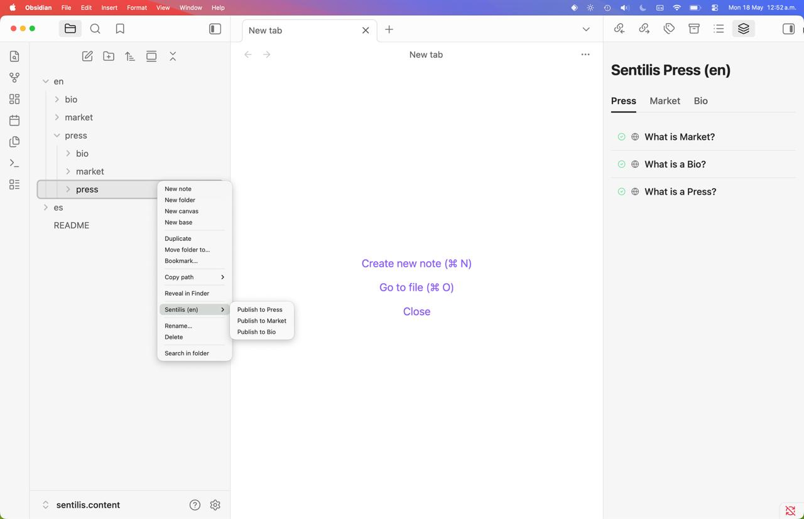

<p align="center">
  <h1 align="center">@sentilis/obsidian</h1>
</p>

<p align="center">
  <strong>The official Obsidian plugin for the Sentilis platform.</strong>
</p>

<p align="center">
<a href="./LICENSE" target="_blank"></a>
<a href="https://obsidian.md" target="_blank"></a>
<a href="https://www.npmjs.com/package/@sentilis/core" target="_blank"></a>
</p>


## Description

The **Sentilis Obsidian Plugin** brings the Sentilis platform directly into your vault. Built on top of [`@sentilis/core`](https://www.npmjs.com/package/@sentilis/core), it lets you author, validate, and publish **Press** articles, **Market** products, and **Bio** profiles from your Markdown notes — without ever leaving Obsidian.

> Looking for ready-made starting points? Browse the [Awesome Templates for Bio, Market & Press](https://sentilis.me/en/press/awesome-templates-bio-market-press-6a0b2e43550ca18de60a7d8a).





## Features

- **Press, Market, and Bio publishing** — push Markdown notes to Sentilis in one click.
- **Multi-profile support** — switch between Sentilis accounts on the fly.
- **Obsidian-native assets** — `![[embeds]]`, standard Markdown images, frontmatter covers, and file attachments resolve automatically.

## Getting Started

### 1. Get your API token

[Sign in](https://id.sentilis.me/login?utm_source=obsidian&utm_medium=readme&utm_campaign=plugin-docs&utm_content=login) or [sign up](https://id.sentilis.me/signup?utm_source=obsidian&utm_medium=readme&utm_campaign=plugin-docs&utm_content=signup) at **id.sentilis.me** and copy the token from your profile. Keep it private.

### 2. Configure a Profile

Open **Settings → Sentilis** and add a profile with:

- **API Token** — the token you copied in step 1.

You can register multiple profiles and switch between them using the command palette:

```text
Sentilis: Change profile
```

### 3. Open the Sidebar

Run the command:

```text
Sentilis: Open sidebar
```

The sidebar lists your Press, Market, and Bio entries for the active profile, with quick actions to view details, open the online URL, copy the link/ID, or delete an item.

### 4. Publish Bio

Create a Markdown file with your Bio frontmatter. Read [What is Bio?](https://about.sentilis.me/bio?utm_source=obsidian&utm_medium=readme&utm_campaign=plugin-docs&utm_content=bio-section) for the full schema.

```md
---
name: Jane Doe
slug: jane-doe
language: en
role: Founder & CEO
status: published
visibility: public
---

# About me

![[avatar.png]]
```

Right-click the file and choose:

```text
Sentilis → Publish to Bio
```

### 5. Publish Press

Create a Markdown file with Sentilis frontmatter. Read [What is a Press?](https://about.sentilis.me/press?utm_source=obsidian&utm_medium=readme&utm_campaign=plugin-docs&utm_content=press-section) for the full schema.

```md
---
name: My First Press
slug: my-first-press
status: published
visibility: public
---

# Hello Sentilis

![[cover.png]]
```

Right-click the file in the explorer and choose:

```text
Sentilis → Publish to Press
```

### 6. Publish Market

Create a Markdown file describing your product. Read [What is Market?](https://about.sentilis.me/market?utm_source=obsidian&utm_medium=readme&utm_campaign=plugin-docs&utm_content=market-section) for the full schema.

```md
---
name: My Product
slug: my-product
kind: digital
price: 29
currency: USD
status: published
visibility: public
---

# Product Description

![[cover.png]]
```

Right-click the file and choose:

```text
Sentilis → Publish to Market
```


## Installation

> 🚀 **Coming soon to the Obsidian Community Plugins directory** — one-click install directly from **Settings → Community Plugins → Browse**. In the meantime, use one of the methods below.

### Manual installation (recommended)

1.  Go to the [GitHub Releases](https://github.com/sentilis/obsidian/releases) page and download the latest `sentilis.zip`.
2.  Extract the archive into your vault's plugins folder:
    ```text
    <VAULT>/.obsidian/plugins/sentilis/
    ```
    The folder should contain `main.js`, `manifest.json`, and `styles.css`.
3.  In Obsidian, open **Settings → Community Plugins**, reload the plugin list, and enable **Sentilis**.

### Symlink installation (for development)

Develop directly from the repository by symlinking it into your vault.

1.  Clone the repository anywhere on your machine:
    ```bash
    $ git clone https://github.com/sentilis/sentilis.obsidian.git
    $ cd sentilis.obsidian
    $ npm install
    $ npm run build
    ```
2.  Symlink the repo into your vault's plugins folder:

    **Linux / macOS**

    ```bash
    $ ln -s /path/to/sentilis.obsidian /path/to/vault/.obsidian/plugins/sentilis
    ```

    **Windows (PowerShell as Administrator)**

    ```powershell
    New-Item -ItemType SymbolicLink `
      -Path "C:\Vault\.obsidian\plugins\sentilis" `
      -Target "C:\Projects\sentilis.obsidian"
    ```


## Stay in touch

- Website — [https://about.sentilis.me](https://about.sentilis.me?utm_source=obsidian&utm_medium=readme&utm_campaign=plugin-docs&utm_content=stay-in-touch-website)
- X — [https://x.com/SentilisMe](https://x.com/SentilisMe)

## Support

For issues and feature requests, please use the GitHub Issues page.

## License

Sentilis Obsidian Plugin is [MIT licensed](./LICENSE).
